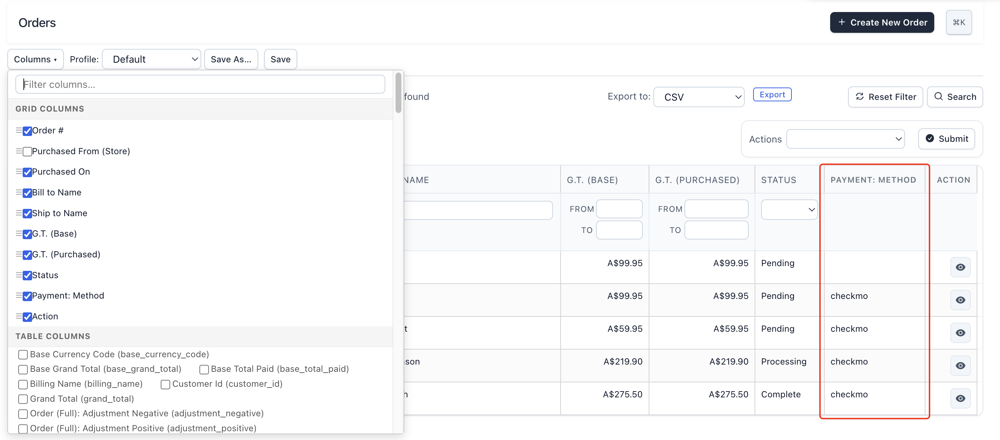
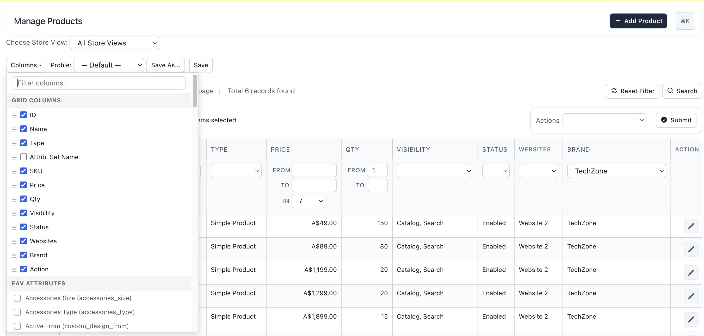

# MageAustralia AdminGrid

Enhanced admin grids for [Maho](https://github.com/mahocommerce/maho) — column visibility, drag-to-reorder, saved profiles, auto-discovered EAV attributes, and cross-table columns. Zero-JOIN architecture safe for large catalogs and high-volume order tables.

Inspired by [BL_CustomGrid](https://github.com/mage-eag/mage-enhanced-admin-grids) by Benoit Leulliette. Built from scratch for Maho with vanilla JS (no Prototype.js dependency).


*Orders grid with Payment Method from `sales_flat_order_payment` table — one-click add from the Columns dropdown.*


*Product grid with Brand EAV attribute column, filtered to "TechZone" — dropdown filter uses EXISTS subquery, no JOINs.*

## Features

- **Column visibility** — show/hide any column with a checkbox, instant CSS toggle (no page reload)
- **Drag-to-reorder** — reorder columns via drag handles in the dropdown
- **Saved profiles** — per admin user, per grid. Switch between profiles instantly
- **Auto-discover EAV attributes** — all product/customer attributes appear in the dropdown, one-click to add
- **Auto-discover table columns** — flat table fields discovered via `DESCRIBE`, including columns added by third-party extensions
- **Cross-table columns** — invoice/shipment/creditmemo grids can pull columns from order and payment tables
- **EAV filtering** — dropdown filter for select attributes, text filter for others, using `EXISTS` subqueries
- **EAV sorting** — correlated subquery in `ORDER BY`, no JOINs
- **Product thumbnails** — image column renderer for `media_image` attributes
- **AJAX grid reload** — adding/removing columns doesn't navigate away from the current page
- **localStorage cache** — saved profile applied instantly on page load before server responds
- **Works on all admin grids** — products, orders, invoices, shipments, creditmemos, customers, newsletters, any custom grid

## Performance: No JOINs

The #1 problem with admin grid customization extensions on large stores is **JOIN-based EAV columns**. Adding LEFT JOINs to a 288K+ row order grid can cause MySQL to abandon index usage and do full table scans, turning a 200ms query into 30+ seconds.

AdminGrid uses a different approach:

### Post-load hydration (EAV columns)

```
Step 1: Grid loads normally — zero extra JOINs
  SELECT * FROM catalog_product_entity ORDER BY entity_id DESC LIMIT 20

Step 2: Batch-fetch EAV values for the 20 visible rows only
  SELECT entity_id, value FROM catalog_product_entity_int
  WHERE attribute_id = 119 AND entity_id IN (31523, 31522, ...)

Step 3: Inject values into collection items in PHP
```

**Trade-off:** 1-2 extra tiny queries (20 rows each) vs. potentially catastrophic JOIN performance.

### Sorting (correlated subquery)

```sql
SELECT * FROM catalog_product_entity e
ORDER BY (
    SELECT value FROM catalog_product_entity_int
    WHERE entity_id = e.entity_id AND attribute_id = 119 AND store_id = 0
    LIMIT 1
) ASC
LIMIT 20
```

The subquery runs on indexed columns (`entity_id` + `attribute_id`). The main query's execution plan stays clean.

### Filtering (EXISTS subquery)

```sql
SELECT * FROM catalog_product_entity e
WHERE EXISTS (
    SELECT 1 FROM catalog_product_entity_int _eav
    WHERE _eav.entity_id = e.entity_id
    AND _eav.attribute_id = 119
    AND _eav.value = 27
)
LIMIT 20
```

No JOIN on the main query. `EXISTS` is well-optimized by MySQL and uses the EAV table's composite index.

## Requirements

- [Maho](https://github.com/mahocommerce/maho) (OpenMage/Magento 1 fork)
- PHP 8.1+
- Two event dispatches in `Mage_Adminhtml_Block_Widget_Grid::_prepareGrid()` (see [Core Events](#core-events) below)

## Installation

### Manual

Copy the module files into your Maho installation:

```
app/code/community/MageAustralia/AdminGrid/    → PHP code
app/etc/modules/MageAustralia_AdminGrid.xml    → module declaration
app/design/adminhtml/default/default/layout/mageaustralia_admingrid.xml → layout
skin/adminhtml/default/default/js/mageaustralia/admingrid.js → JS
```

For Composer-based installations, add `app/code/community/` to your `composer.json` classmap:

```json
{
    "autoload": {
        "classmap": [
            "app/code/community/"
        ]
    }
}
```

Then run `composer dump-autoload`.

### Core Events

AdminGrid requires two event dispatches in Maho core. Add them to `Mage_Adminhtml_Block_Widget_Grid::_prepareGrid()`:

```php
protected function _prepareGrid()
{
    $this->_prepareColumns();
    Mage::dispatchEvent("admingrid_prepare_columns_after", [
        "grid" => $this, "grid_block_id" => $this->getId()
    ]);
    $this->_prepareMassactionBlock();
    $this->_prepareCollection();
    Mage::dispatchEvent("admingrid_collection_load_after", [
        "grid" => $this, "collection" => $this->getCollection()
    ]);
    return $this;
}
```

A PR to add these events to Maho core is planned.

## Usage

### Column visibility

Click **Columns** on any admin grid. The dropdown shows:

- **Grid Columns** — existing columns with checkboxes to show/hide and drag handles to reorder
- **Table Columns** — flat table fields from the grid's database table (auto-discovered)
- **EAV Attributes** — product/customer attributes (auto-discovered)

Check a column to add it. Uncheck a custom column to remove it. Changes apply via AJAX — no full page reload.

### Profiles

- **Save** — saves the current column configuration (visibility + order) to the database
- **Save As...** — creates a new named profile
- **Profile dropdown** — switch between saved profiles

Profiles are per admin user, per grid. Each user can have different column layouts.

### Admin configuration

- **System > Configuration > MageAustralia > Admin Grid** — enable/disable the module
- **System > Admin Grid Profiles** — view all discovered grids and manage custom columns

## Architecture

### Database tables

| Table | Purpose |
|-------|---------|
| `mageaustralia_admingrid_grid` | Auto-discovered grid registry |
| `mageaustralia_admingrid_profile` | User profiles (column config JSON) |
| `mageaustralia_admingrid_custom_column` | Custom column definitions |
| `mageaustralia_admingrid_options_source` | Options sources for dropdown columns |
| `mageaustralia_admingrid_options_value` | Options source values |

### Column types

| Source | Sort | Filter | Data |
|--------|------|--------|------|
| **EAV attribute** | Correlated subquery | EXISTS subquery | Post-load hydration |
| **Primary table** | Native SQL | Native SQL | Already in collection |
| **Related table** | Not yet | Not yet | Post-load hydration |

### File structure

```
app/code/community/MageAustralia/AdminGrid/
├── Block/Adminhtml/           # Admin UI blocks
├── controllers/Adminhtml/     # JSON API + admin pages
├── etc/                       # config.xml, adminhtml.xml, system.xml
├── Helper/Data.php            # Entity/table discovery
├── Model/                     # Grid, Profile, Column, Observer
│   ├── Observer.php           # Core logic: column injection + hydration
│   └── Resource/              # DB resource models
└── sql/                       # Install script (5 tables)

skin/adminhtml/default/default/js/mageaustralia/admingrid.js  # Vanilla ES6
```

## License

OSL-3.0 — same as Maho and the original BL_CustomGrid.

## Credits

Architectural inspiration from [BL_CustomGrid](https://github.com/mage-eag/mage-enhanced-admin-grids) (Enhanced Admin Grids) by Benoit Leulliette — specifically the database schema design, column origin classification system, and the concept of per-user grid profiles.
